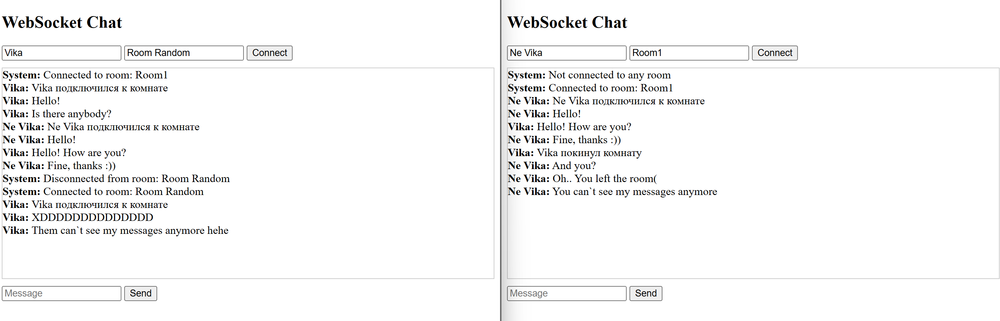
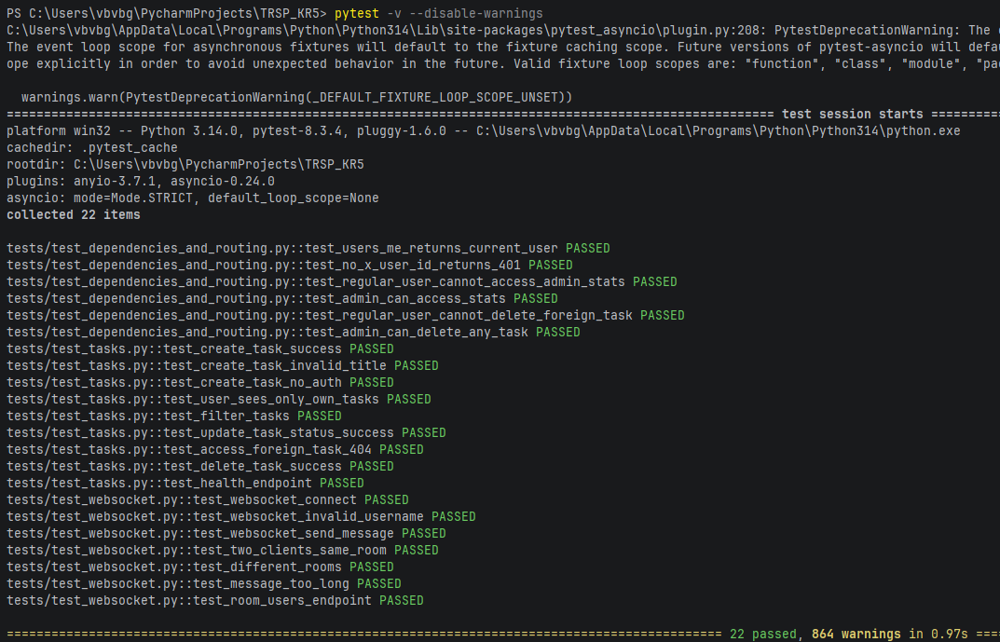

REST API для управления задачами с WebSocket чатом и Docker-контейнеризацией.

## Описание проекта

REST API для управления задачами с возможностями:
- Создания, просмотра, редактирования и удаления задач
- Фильтрации задач по статусу и приоритету
- Ролевой модели (обычный пользователь / администратор)
- WebSocket чата с комнатами
- Docker-контейнеризации

## Технологии

- **FastAPI** - веб-фреймворк
- **Uvicorn** - ASGI сервер
- **Pytest** - тестирование
- **WebSockets** - обмен сообщениями в реальном времени
- **Docker** - контейнеризация

## Установка и запуск

### Локальный запуск

## 1. Клонировать репозиторий (или перейти в папку проекта)
```bash
git clone https://github.com/ISHIKHIN/TRSP_KR5
```
## 2. Создать виртуальное окружение
```bash
python -m venv .venv
```
## 3. Активировать виртуальное окружение
```bash
# Windows:
.venv\Scripts\activate

# Linux/Mac:
source .venv/bin/activate
```
## 4. Установить зависимости
```bash
pip install -r requirements.txt
```
## 5. Запустить приложение
```bash
uvicorn app.main:app --reload
```
## 6. Запуск тестов
```bash
pytest -v
```
# 7. Открыть в браузере
### Swagger документация: http://localhost:8000/docs
### ReDoc документация: http://localhost:8000/redoc

# Открыть test_websocket.html с запущенным проектом:
### test_websocket.html: Попробовать WebSocket чат с визуализацией
### Пример использования: 


# Запуск тестов приложения и вывод результата:

